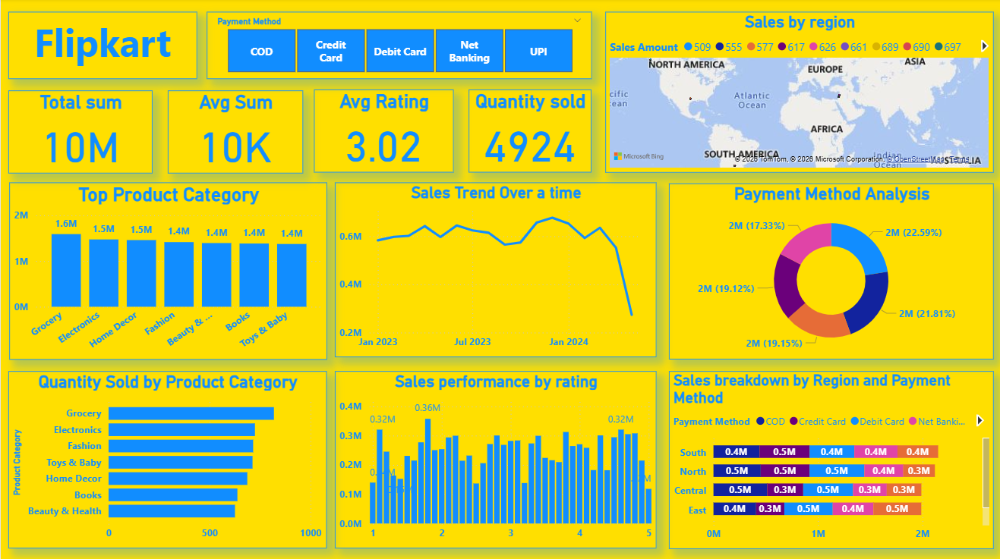

# Flipkart Sales Analysis - Power BI Dashboard

An interactive Power BI dashboard analyzing Flipkart sales data, covering KPIs, regional sales, product categories, sales trends, payment methods, and performance by customer rating.

## Dashboard Preview

## Key Features
- KPI cards: total sales, average sales, average rating, quantity sold
- Sales by region (map) and region vs. payment method breakdown
- Top product categories and quantity sold by category
- Sales trend over time
- Payment method analysis
- Sales performance by rating

## Tools Used
Power BI, DAX, Power Query

## How to Open
Download the `.pbix` file and open it in Power BI Desktop.
